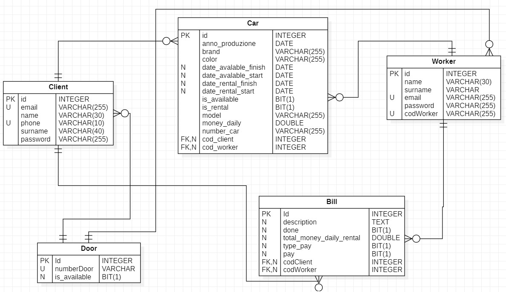

# Manage and rental car

### Purpose 

This project have two purposes:

>
>1) Rental the car for the client
>1) Manage the car for the worker
>

### Project organization

I have divided the project into several task:

- Frist task
  > Start with the question on:
  > - What dates must manage?
  > - How i must manage must?
  > - What tools will i use?
  > 

- Second task
  > Think tools:
  > In fact, i thought at the possible tools for the make the project.  I choose:
  > - SQL (DBMS is MySQL) for the create database
  > - Java (for the part Back-End) with use the framework Spring-boot
  > - JavaScript (for the part Front-End) with use the framework ReactJs
  
- Third task
  > Create the Diagrams:
  > - UML
  > - E-R
  

- Fourth task
  > Create the repository on git
  
- Fiverth task
  > Write the code
  >> - SQL
  >> - Java
  >> - JavaScript

## How install the project

### Install the software:

  > Part database
  > You have two ways:
  >1) Install MySQL Shell (Link for download : [MySQL](https://dev.mysql.com/doc/mysql-shell/8.0/en/mysql-shell-install.html))
  >1) Install XAMPP (Link for download : [XAMPP](https://www.apachefriends.org/download.html))
  > IF you use the first way so you must modify the file application properties.

  > Back-End software
  > You must have a version di Java 11 or higher
  > - IDE of Java (Link for download: [Ecplise](https://www.eclipse.org/downloads/packages/release/2022-09/r/eclipse-ide-enterprise-java-and-web-developers))
